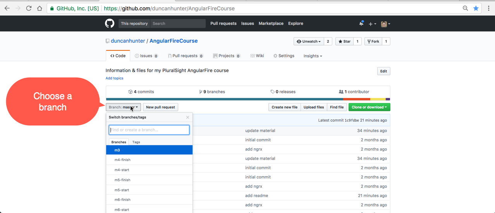

# Building Apps With AngularFire Course

> !!! IMPORTANT This course is for the previous version of Angularfire2 (v4). This course now is a good way to learn the concepts of Angularfire and the Realtime DB or if you are developing on V4 of Angularfire 2 this is a great course.

> For those wanting to use the new Firestore database from Google or use the latest Angularfire2 v5+ then this code will need to be adapted. Due to the many syntactic changes in Angularfire2 (v5) a whole new course needs to be recorded for Pluralsight, which I aim to do in the future.

## How to install code for each course module
> All before and after code demos are in branches you can clone and run.


To clone a branch from this GitHub repo run the following commands:
1. Clone the repo in to a directory of choice
```
git clone "https://github.com/duncanhunter/AngularFireCourse"
```
2. Change directory into the project folder
```
cd AngularFireCourse
```
3. Check out all branches for each part of the course
```
git branch --all
```
4. Change to a particular part of the course code and install packages with npm install
```
git checkout --quiet m4-start 

npm install 
```
5. Run ng serve to run the code and open the broswer at localhost:4200
```
ng serve --open
```

## Changes/Fixes

#### 2/10/2017
- Update material.angular.io install video and all code branches to show individual Material component modules being installed. In module Retrieving and Working with Firebase Objects > Adding Angular Material.
- Update video showing old reference of how to import AngularFire vs AngularFireDatabase in module Installation and Setup > Configure and Install AngularFire.
- Updated missing half screen in module Querying Firebase Lists With Observables > Multipath Updates Demo.
- Added all code branches and info to this GitHub repo
